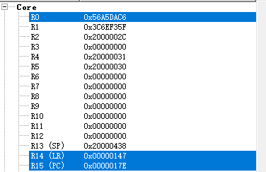
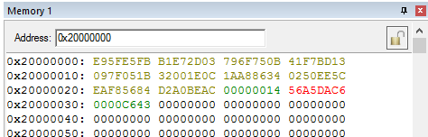
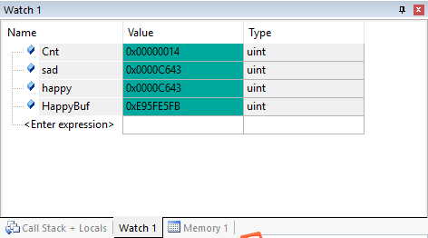

#Lab11 FunctionalDebugging

##Keil调试器的使用

参考TA给出的debug.doc文档大概知道如何去调试和运行代码，以及从哪些窗口观察得到register和memory等。

##Register和Memory值的变化

Register值的变化：

Memory值的变化：

##Cnt变量和HappyBuf的最终值

从图可以看出Cnt最终值为0x00000014，即为十进制的20；
而HappyBuf的最终值为0xE95FE5FB对应二进制的11101001010111111110010111111011；

出现的原因：在project的main.s中，一开始先进入Init状态，初始化Cnt为0，然后进入循环，开始给sad和happy赋值，是根据Cnt讲sad和happy对应存储到SadBuf和HappyBuf里，然后Cnt加1，直到Cnt与Size（初始定义为20）相等时跳至done状态结束。这里的定义的Size就是循环的次数，所以最后Cnt会自加到20，而HappyBuf也会被随机的0或1填满。

##实验感想

通过本次实验学会基本使用Keil，再一次复习汇编语言。