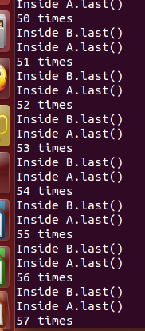

#Lab4：死锁
##死锁的4个必要条件
　　1.互斥条件（Mutual exclusion）：进程对所分配到的资源不允许其他进程进行访问。

　　2.占有且等待条件（Hold and wait）：一个进程因请求资源而被阻塞时，对已获得的资源保持不放。

　　3.非抢占条件（No preemption）：进程已获得的资源，在未完成使用之前，不可被剥夺

　　4.循环等待条件（Circular wait）：若干进程之间形成一种头尾相接的循环等待资源关系。

##死锁产生截图

　　

##死锁解释

　　在函数Deadlock（）函数里，代码`t.start()`执行后，线程t进入调度队列；当t被调度执行run函数时，while循环也刚好跳出，这时methodA和methodB就会同时调用执行，这时就会产生死锁。因为两个函数都用到关键字synchronized，当methodB执行`a.last()`时，methodA同时在执行`b.last()`，这时a被methodA阻塞，而b被methodB阻塞，陷入死循环，没有一个能释放资源，所以死锁产生。