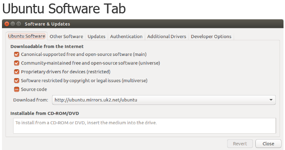
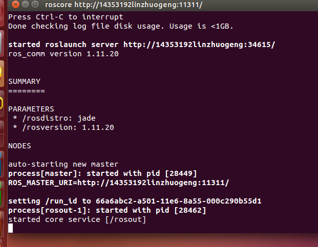

#Lab5—安装ROS
##1.安装步骤

　　a）Configure your Ubuntu repositories
　　

　　b）Setup your sources.list

　　`sudo sh -c 'echo "deb http://packages.ros.org/ros/ubuntu $(lsb_release -sc) main" > /etc/apt/sources.list.d/ros-latest.list'`
 
　　c）Set up your keys

　　`sudo apt-key adv --keyserver hkp://ha.pool.sks-keyservers.net:80 --recv-key 0xB01FA116`

　　d）Installation

	　　`sudo apt-get update` 
	
　　Desktop-Full Install ：

　　`sudo apt-get install ros-jade-desktop-full`

　　e）Initialize rosdep

　　`sudo rosdep init`

　　`rosdep update`

　　f）Environment setup

　　`echo "source /opt/ros/jade/setup.bash" >> ~/.bashrc`

　　`source ~/.bashrc`

　　g）Getting rosinstall

　　`sudo apt-get install python-rosinstall`
　　
##2.安装成功截图

##3.安装过程遇到的问题
　　一开始打开ubantu一直上不了网，所以自己手动设置了IP地址等信息让其成功上网；但是到rosdep update这一步时一直显示读取超时，还来发现是DNS填错了导致一直登不了指定网站才超时，修改DNS后就正常了。
