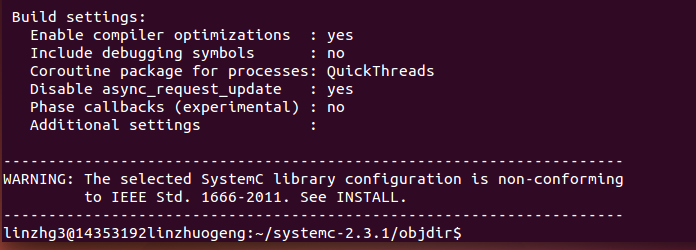
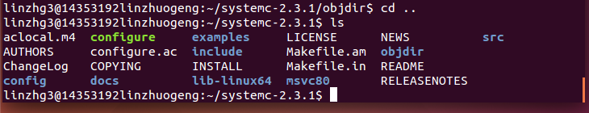
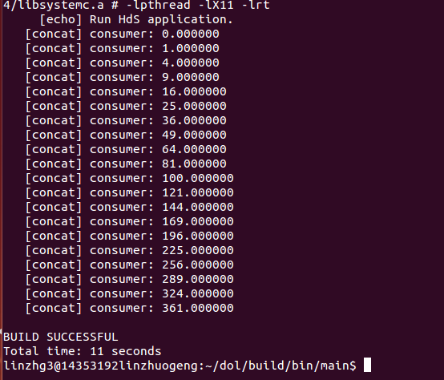

# 嵌入式实验--DOL
##*Description

　　分布式操作层（DOL）是一个框架，使（半）应用的自动绘制映射到多处理器图形架构平台。基本组成由三部分：DOL Application Programming Interface，DOL Functional Simulation，DOL Mapping Optimization.

　　详情可点击[http://www.tik.ee.ethz.ch/~shapes/dol.html](http://www.tik.ee.ethz.ch/~shapes/dol.html)查看。

##*Lab1： DOL开发环境配置
　　１．**解压文件**

　　　　`$ mkdir dol`

　　　　`$ unzip dol_ethz.zip -d dol`

　　　　`$ tar -zxvf systemc-2.3.1.tgz`

　　２．**编译systemc**

　　　　`$ cd systemc-2.3.1`

　　　　`$ mkdir objdir`

　　　　`$ cd objdir`

　　　　`$ ../configure CXX=g++ --disable-async-updates`

　　　　下图为运行configure之后的截图

　　　　

　　　　`$ sudo make install`

　　　　下图为编译完后文件目录

　　　　

　　　　最后执行pwd记录当前的工作路径

　　　　`$ pwd`

　　３．**编译dol**

　　　　`$ cd ../dol`

　　　　修改build_zip.xml文件

　　　　`$ ant -f build_zip.xml all`

　　　　若成功会显示build successful

　　　　`$ cd build/bin/main`

　　　　`$ ant -f runexample.xml -Dnumber=1`

　　　　下图为编译完后的结果

　　　　

##*Experimental experience

　　1. lab1：第一次实验只是安装DOL所以不知道具体DOL有什么作用；但是通过建立库和写readme文件知道一些文件同步和markdown的知识。
