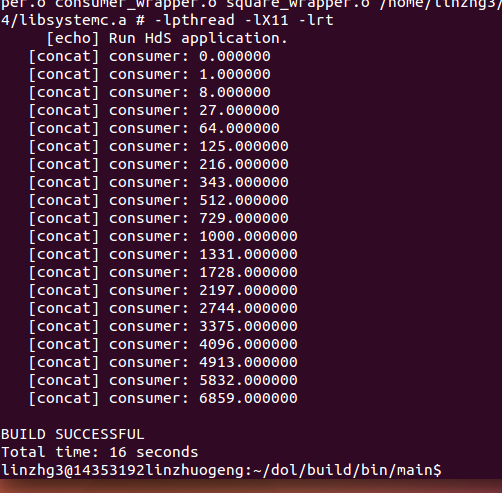
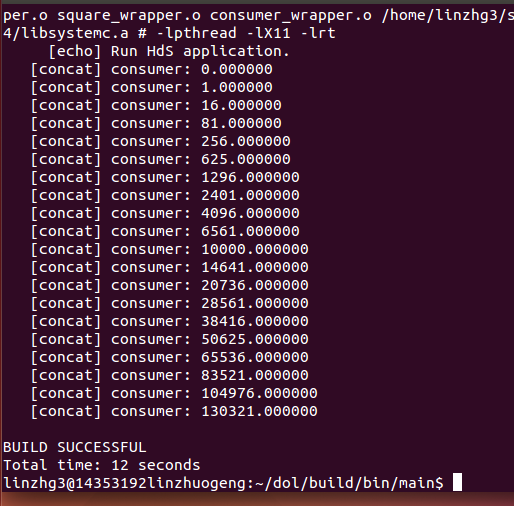

#Lab3-DOL实例分析&编程
##example1修改后的截图如下：

　　
       
　　修改方法：
       
　　找到examp1里面的square.c代码中的square_fire函数，把里面的`i=i*i`修改为`i=i*i*i`，
       
　　因为`i*i`表示平方，多乘一个i就相当于立方。
       
##example2修改后的截图如下：

　　

　　修改方法：

　　找到example2里面的example2.xml代码里面的`<variable value="3" name="N"/>`，把其

　　中的3改成2 ，这里定义的N=3就是下面迭代的次数，因为下面的iterator中定义了迭代

　　次数范围为N；所以只要把N的value改为2就能让3个square模块变成2个。

##实验感想

　　通过本次实验学会如何去理解example里面的代码及其对应的功能；同时知道原理后可以

　　修改代码使其输出我们想要的结果。